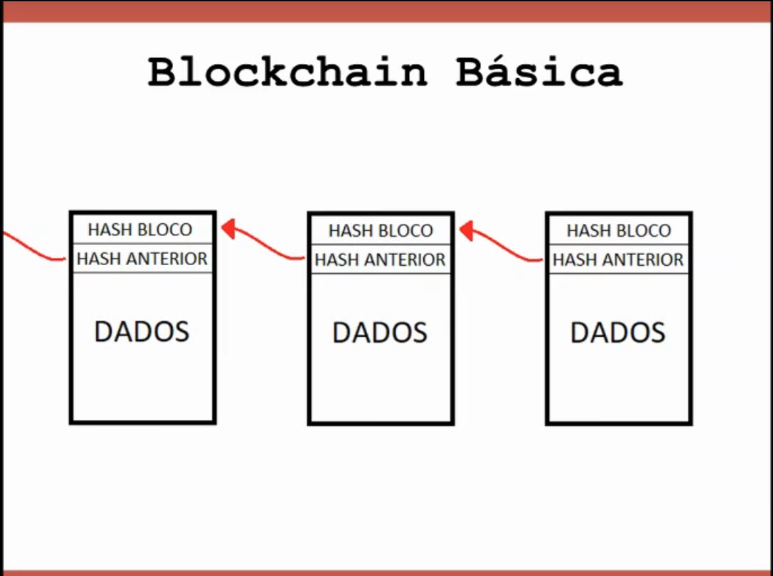
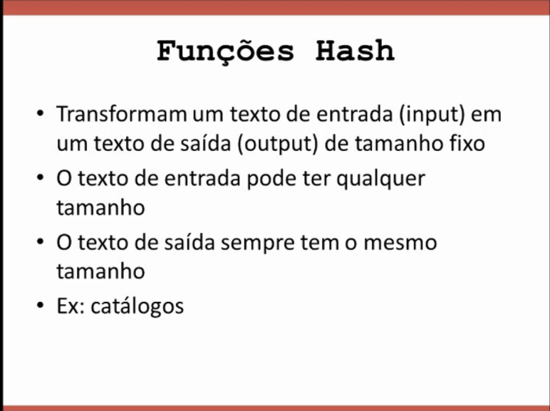
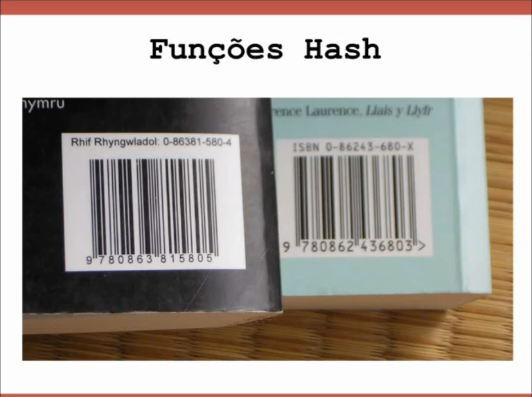
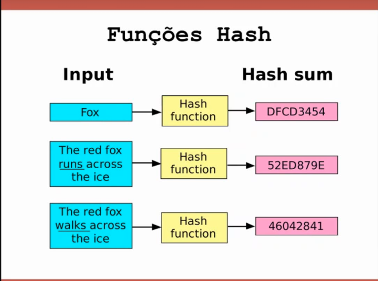
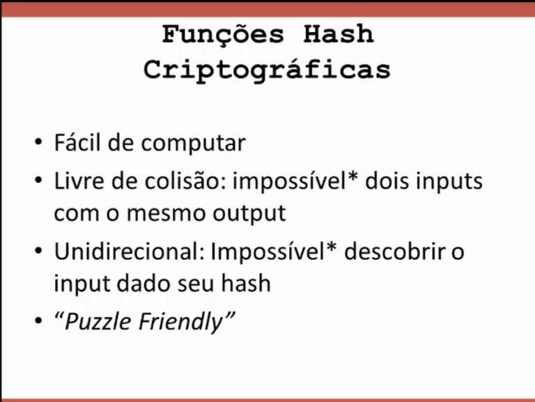
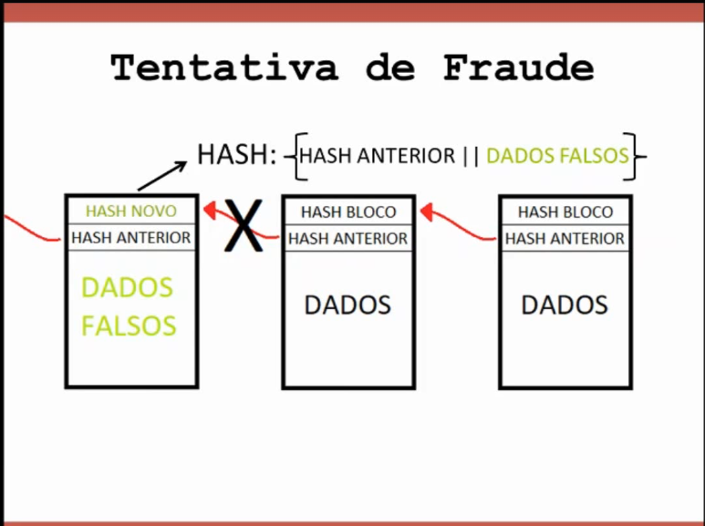
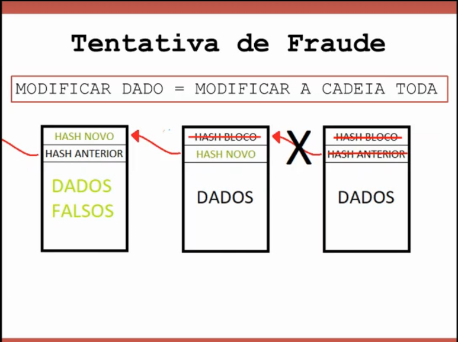

# Como funciona o Bitcoin: O que precisamos saber?

É importante que vocês tenham alguns fundamentos básicos das tecnologias por trás do Bitcoin. A primeira delas é a **blockchain**. Depois, na próxima aula, eu também vou falar sobre **criptografia de chave pública**, mas por enquanto esta aula é só sobre blockchain.

## O que é uma blockchain?

Uma blockchain, como o nome diz, é uma cadeia de blocos. Cada bloco contém uma série de dados, como informações de transações (no caso do Bitcoin), mas podem ser qualquer coisa que possa ser traduzida em dados de computador: imagens, filmes, vídeos, músicas, textos em geral. Além disso, cada bloco também contém informações sobre o bloco anterior, o que cria a cadeia.

## Por que a blockchain é segura?

**Resposta:** A propriedade mais importante da blockchain é que, se eu alterar um dado em um bloco, todos os blocos a partir desse ponto também serão alterados, garantindo a integridade. Isso é possível graças à função Hash, uma função matemática.

## Como funciona uma função Hash?

**Resposta:** Uma função Hash pega um texto de entrada (input) de qualquer tamanho e gera um texto de saída (output) de tamanho fixo, que é uma combinação de letras e números. Essa função tem várias propriedades que garantem a segurança da blockchain, como a dificuldade de gerar o mesmo output para diferentes inputs e a irreversibilidade do processo.

## Exemplo prático

**Resposta:** No exemplo de um catálogo de livros, cada título tem um código ISBN de tamanho fixo, independentemente do tamanho do livro. Da mesma forma, uma função Hash criptográfica cria um código fixo a partir de qualquer tamanho de texto.

## O que significa a função Hash ser livre de colisão?

**Resposta:** Significa que é extremamente improvável que dois inputs diferentes gerem o mesmo output. Embora seja teoricamente possível, na prática, encontrar dois inputs que gerem o mesmo Hash é virtualmente impossível.

## Como a função Hash garante a segurança da blockchain?

Ela é unidirecional, ou seja, dado um output, é quase impossível determinar qual foi o input que o gerou. Para descobrir, seria necessário testar todos os inputs possíveis. Além disso, ela é "puzzle friendly", o que significa que pequenas mudanças no input causam grandes mudanças no output.

## Função Hash criptografada

## O que torna a blockchain inviolável?

**Resposta:** A blockchain é inviolável porque cada bloco contém o hash do bloco anterior. Se um hacker tentar modificar os dados de um bloco, ele terá que alterar o hash desse bloco e o hash de todos os blocos subsequentes, o que tornaria evidente qualquer tentativa de fraude.

