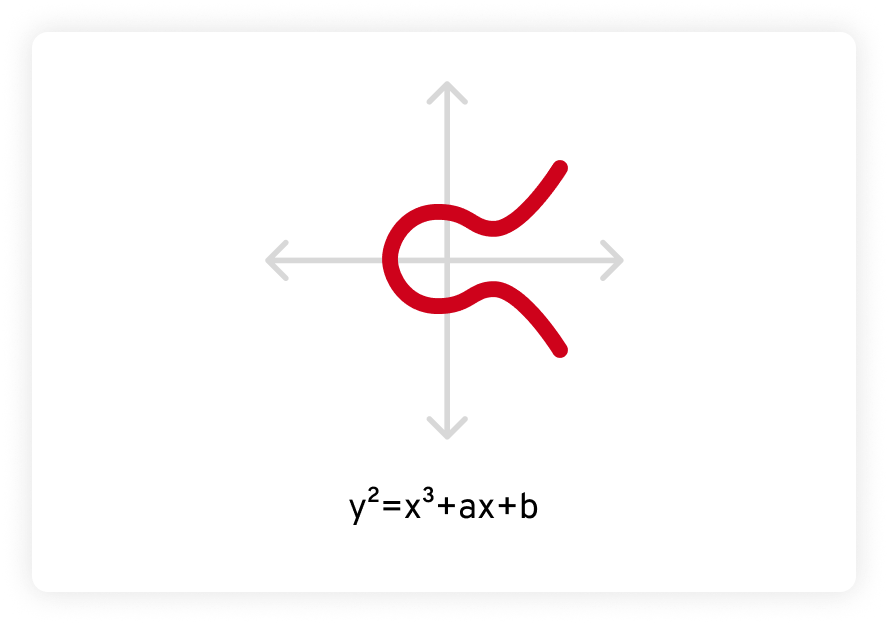

# O que é criptografia de curva elíptica?

A criptografia de curva elíptica (ECC) é uma forma de criptografia de chave pública baseada na matemática das curvas elípticas. Ela fornece uma maneira segura de realizar operações criptográficas, como troca de chaves, assinaturas digitais e criptografia. A ECC é uma alternativa à criptografia Rivest-Shamir-Adleman (RSA), que foi publicada pela primeira vez em 1977.

Continue lendo para saber mais sobre criptografia de curva elíptica e por que ela é considerada a forma mais segura de criptografia.

## Qual é a diferença entre ECC e RSA?

Antes de discutir as diferenças entre ECC e RSA, é importante entender como os algoritmos criptográficos de chave pública funcionam. Basicamente, os algoritmos criptográficos robustos são “funções arapuca”. Embora seja fácil passar por uma arapuca, voltar no sentido oposto é muito difícil porque as arapucas abrem apenas em uma direção. Logo, para um algoritmo criptográfico ser eficaz e seguro, deve ser fácil criptografar uma mensagem, mas quase impossível descriptografá-la sem a chave de descriptografia.

A ECC e o RSA são algoritmos de criptografia de chave pública que utilizam funções matemáticas altamente avançadas. A criptografia de chave pública tem dois componentes, uma chave pública e uma privada. A chave pública criptografa uma mensagem aplicando um algoritmo matemático para transformá-la em um número muito grande e aparentemente aleatório. Essa mensagem pode ser descriptografada apenas com a chave privada, que aplica ao número aparentemente aleatório um algoritmo diferente que, essencialmente, “desfaz” o original.

Os cálculos matemáticos por trás da ECC e do RSA são tão complexos que podem ser resolvidos apenas por computadores. A matemática por trás do algoritmo RSA está além do escopo deste blog, mas o ponto crucial é que a segurança do RSA depende da imensa dificuldade de fatorar números muito grandes em seus primos compostos.

Para aqueles que precisam refrescar a memória, é assim que fatoramos o número 20:

20 = 4 * 5 = 2 * 2 * 5 = 22 * 5

Parece simples, certo? Agora imagine fazer isso com um número de mais de 100 dígitos. É por isso que, mesmo com uma chave pública, calcular a chave privada sem saber os fatores primos exige computação extremamente intensiva.

## Problemas com a criptografia RSA

Embora o algoritmo RSA seja bastante robusto, tem os seus problemas.

Fatorar números muito grandes é extremamente difícil, mas é menos difícil do que costumava ser. A fatoração é um componente principal do cálculo e de outras matemáticas avançadas, de modo que os matemáticos passaram séculos buscando maneiras de facilitá-la. Existem algoritmos eficientes para fatorar números grandes, como o campo de número de peneira geral, que é atualmente o método mais conhecido para fatorar números grandes com mais de 110 dígitos.

Enquanto isso, o poder computacional está se expandindo a uma taxa surpreendente. Em 1965, o cofundador da Intel, Gordon Moore, previu que o número de transistores em um microchip dobraria a cada um ou dois anos. Essa hipótese é conhecida como Lei de Moore e, desde a década de 1970, ela foi cumprida ou excedida. O poder de computação dobra a cada cerca de dois anos, e o seu preço está caindo.

À medida que os recursos de computação necessários para fatorar números extremamente grandes tornam-se mais disponíveis e acessíveis para uma grande parte do público (incluindo cibercriminosos), os tamanhos de chaves RSA devem crescer para acompanhar. Por causa disso, o RSA tem velocidades de criptografia e descriptografia bastante lentas, tornando-o inviável para criptografar mensagens grandes, especialmente em dispositivos móveis. Ao invés disso, o RSA é comumente utilizado para troca de chaves e assinaturas digitais, onde os dados reais são criptografados utilizando algoritmos de criptografia simétrica com chaves de sessão mais curtas.

Por outro lado, a criptografia de curva elíptica oferece uma segurança indiscutivelmente melhor com comprimentos de chave menores, sendo mais eficiente em termos de requisitos de computação e largura de banda. Examinaremos como a ECC funciona na próxima seção.

## Como a criptografia de curva elíptica funciona?

A ECC é baseada em outra área da matemática avançada, chamada curvas elípticas. Uma curva elíptica é definida por uma equação na forma de y2 = x3 + ax + b, na qual a e b são constantes e a curva é definida sobre um campo finito. Quando colocada em um gráfico, fica assim:

## Propriedades das Curvas Elípticas

Curvas elípticas possuem algumas propriedades especiais que as tornam interessantes e úteis para matemáticos e criptógrafos. Primeiro, curvas elípticas são horizontalmente simétricas. Quando refletida pelo eixo x (a linha horizontal), os dois lados são iguais, como uma imagem espelhada.

Além disso, qualquer linha reta não vertical desenhada cortando uma curva elíptica sempre cruzará a curva em, no máximo, três lugares. No exemplo abaixo, esses pontos são chamados de P, Q e R.

! [Curva Elíptica](curva_eliptica2.png)

## A segurança da criptografia de curva elíptica

A segurança da criptografia de curva elíptica é baseada na dificuldade de resolver o que é conhecido como o problema do logaritmo discreto de curva elíptica. Dado um ponto P na curva e um k escalar, é extraordinariamente difícil determinar o ponto Q de forma que Q = k*P, muito mais difícil do que fatorar até mesmo um número muito grande.

Essa propriedade significa que a ECC pode fornecer segurança comparável ou até mesmo melhor que o RSA com tamanhos de chave muito menores.

### Benefícios da criptografia de curva elíptica

O fato de a ECC fornecer um nível muito alto de segurança com comprimentos de chave pequenos proporciona vantagens sobre o RSA e outros algoritmos de criptografia de chave pública.

Aqui estão dois benefícios de utilizar a criptografia de curva elíptica:

- **Menor uso de recursos computacionais:** A ECC requer menos recursos computacionais e menos largura de banda para criptografia, descriptografia e geração de chaves.
- **Maior velocidade:** Devido ao menor tamanho da chave ECC, operações como criptografia, descriptografia e geração de chaves podem ser realizadas com maior rapidez em comparação com o RSA, o que significa menos latência para o usuário final.

Essas vantagens tornam a ECC especialmente útil em ambientes com recursos restritos, como dispositivos móveis e com internet das coisas (IoT).

### O quanto a criptografia de curva elíptica é segura?

Embora o algoritmo de criptografia RSA seja extremamente seguro, a ECC é indiscutivelmente ainda melhor.

Os computadores quânticos teoricamente têm o potencial de quebrar o RSA resolvendo eficientemente o problema de fatoração sobre o qual ele é baseado. Se isso ocorrerá em breve, é um assunto de grande debate. No entanto, é seguro dizer que, devido à complexidade da ECC, ela é mais resistente a ataques de computação quântica em comparação com o RSA.

O quanto é resistente? O matemático holandês Arjen Lenstra coescreveu um artigo de pesquisa que comparou a quebra de algoritmos criptográficos à ebulição de água. A ideia é calcular quanta energia é necessária para quebrar um algoritmo criptográfico específico, e depois calcular quanta água essa energia pode ferver. Utilizando essa metáfora:

- É preciso de menos energia para quebrar uma chave RSA de 228 bits do que para ferver uma colher de chá de água.
- A energia necessária para quebrar uma chave ECC de 228 bits poderia ferver toda a água da Terra.

O mesmo nível de segurança com o RSA exigiria uma chave de 2.380 bits.

### Onde a criptografia de curva elíptica é utilizada

Conforme mencionado anteriormente, o tamanho menor da chave ECC a torna perfeita para dispositivos com poucos recursos de CPU e memória, como dispositivos móveis e de IoT. Isso permite que desenvolvedores de aplicativos web e móveis criem sites e aplicativos de alto desempenho e baixa latência enquanto ainda oferecem segurança de dados robusta aos usuários. A ECC é frequentemente utilizada para proteger protocolos de comunicação móveis sem fio, como Bluetooth, Wi-Fi e NFC (Near Field Communication).

Aqui estão alguns casos de uso mais comuns da ECC:

1. **Protocolos de comunicação segura:** 
   - A ECC é utilizada em diversos protocolos de comunicação segura para fornecer criptografia, assinaturas digitais e troca de chaves.
   - Exemplos incluem o Transport Layer Security (TLS) utilizado na navegação segura, Secure Shell (SSH) para login remoto seguro e redes privadas virtuais (VPNs) para comunicação de rede segura.

2. **Criptomoedas e tecnologia de blockchain:** 
   - Muitas criptomoedas, incluindo Bitcoin, Ethereum e Litecoin, utilizam criptografia de curva elíptica para gerar pares de chaves pública e privada, bem como para assinar transações.
   - A ECC fornece a segurança criptográfica necessária para proteger ativos digitais e garantir a integridade de redes de blockchain.

3. **Cartões inteligentes e sistemas embarcados:** 
   - A ECC é comumente utilizada para proteger sistemas de pagamentos, sistemas de controle de acesso, passaportes eletrônicos e outras aplicações que exigem soluções criptográficas seguras e compactas.

4. **Assinaturas e certificados digitais:** 
   - A ECC pode ser utilizada para gerar assinaturas digitais, que são utilizadas para verificar a autenticidade e integridade de documentos e mensagens digitais.
   - Assinaturas digitais baseadas em ECC também são empregadas em sistemas de infraestrutura de chave pública (PKI) para emitir e validar certificados digitais.

Embora a ECC seja bastante nova em comparação com o RSA, ela conta com ampla padronização e suporte por organizações privadas e órgãos do setor. Por exemplo, o Instituto Nacional de Padrões e Tecnologia dos EUA (NIST) padronizou a ECC em seu conjunto de algoritmos criptográficos. Além disso, a ECC é suportada por bibliotecas criptográficas, linguagens de programação e sistemas operacionais populares. Essa aceitação promove ainda mais sua adoção em diversos setores, como finanças, saúde e serviços governamentais.

### Conclusão

Considerando esses fatores, é seguro dizer que a criptografia de curva elíptica é popular e amplamente utilizada em uma série de aplicações e setores. Sua eficiência, segurança e o amplo suporte a tornaram uma escolha confiável para comunicação segura e operações criptográficas.

